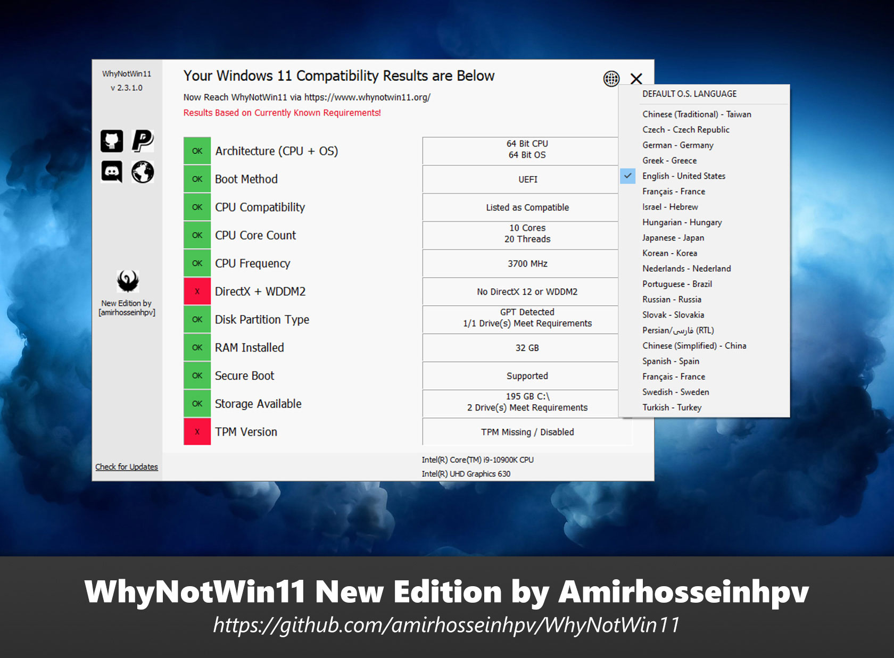

# WhyNotWin11
Detection Script to help identify why your PC isn't Windows 11 Release Ready

----

## New Edition, Version 2.3.1

In this version I've enhanced multi-lingual feature so users can select language from a list and apply custom language regarding their own system locale.

I've also changed UI a bit, made the whole window dragable and changed Font size.

* DEV: Added _GUICtrlSetDataEx function to set Control item's data and color at-once, and also generates auto-color based on ctrl text

* DEV: Added Restart Feature, could be called with _ScriptRestart

* DEV: RTL/LTR Fully supported, just add RTL=true in MetaData section of your language

* DEV: Exit button text changed from X to × which look cool :)

* DEV: Added my logo to resources

## Download
[Download latest stable release (Portable)](https://github.com/amirhosseinhpv/WhyNotWin11/releases/latest/download/WhyNotWin11-portable.zip)
[Download latest stable release (SOURCE)](https://github.com/amirhosseinhpv/WhyNotWin11/releases/latest/download/WhyNotWin11-source.zip)

## License

WhyNotWin11 is free and open source software, it is using the LGPL-3.0 license.

See LICENSE for the full license text.
